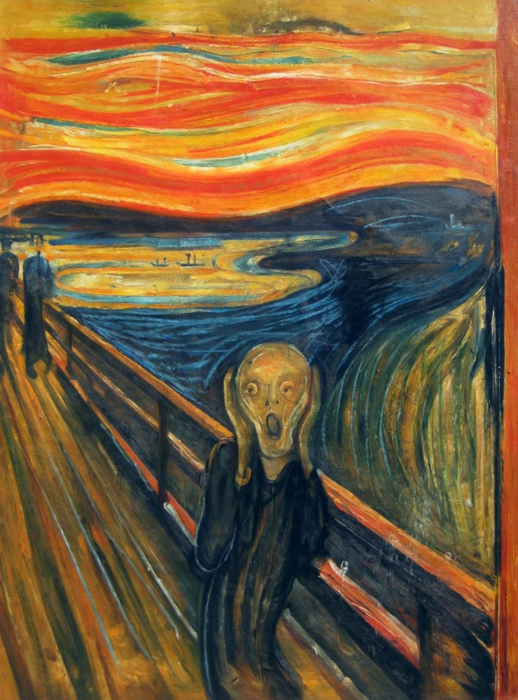

# SSBI-DATA-VISUALIZATION

### Topics
- Introduction
- Percepção Visual
- Córtex visual e processamento pré-atento
- Princípios de Gestalt aplicados a dashboards
- Carga cognitiva e o limite da memória de trabalho

## Intruduction
Visualização de dados vai além de criar um gráfico de pizza e adicionar uma tabela. Seja um filme, uma caminhada ou um dashboard, tudo o que vemos estimula áreas diferentes do nosso cérebro. Se queremos desenvolver uma visualização profissional, devemos estimular as áreas corretas - é isso que separa um gráfico qualquer de uma visualização que realmente comunica.

Nesse repositório, vou explorar a neurociência por trás da visualização de dados e como usá-la a nosso favor.

## Percepção Visual
É a aquisição, interpretação, seleção e organização das informações obtidas pelo sentido.

Um dashboard profissional se apoia em como o cérebro processa estímulos visuais, não apenas em organizar dados na tela. O Grito, de Edvard Munch, ilustra esse princípio: as linhas curvas que distorcem o lago e o céu guiam o olhar do espectador diretamente para a figura central, comunicando angústia antes mesmo de qualquer análise consciente. Dashboards eficazes usam o mesmo recurso — cor, forma e posição direcionam a atenção do usuário para o que importa, antes que ele precise "ler" o dado.

## Córtex visual e processamento pré-atento
O cérebro processa certas propriedades visuais antes da atenção consciente entrar em ação - isso se chama processamento pré-atentivo. Isso acontece porque o córtex visual primário (V1) e áreas associadas processam cor, orientação, movimento e tamanho em paralelo, em milissegundos, antes de qualquer "leitura" cognitiva do conteúdo. É por isso que, num gráfico de dispersão com 50 pontos azuis e 1 ponto vermelho, você enxerga o ponto vermelho instantaneamente — sem precisar procurar. Nenhum esforço consciente é gasto nisso. Um dashboard profissional usa cor, tamanho e posição para explorar esse canal pré-atentivo — reservando esses atributos para o dado mais importante, em vez de usá-los decorativamente em tudo.

## Princípios de Gestalt aplicados a dashboards

Proximidade: elementos próximos são percebidos como um grupo. Aplicação: KPIs relacionados devem ficar fisicamente próximos no layout, não espalhados pela tela só porque "cabe espaço ali".
Similaridade: elementos com a mesma cor/forma são percebidos como pertencentes à mesma categoria. Aplicação: se "receita" é sempre azul em todos os gráficos do dashboard, o usuário generaliza essa regra sem precisar de legenda toda vez.
Continuidade: o olho segue linhas e curvas contínuas. Aplicação: gráficos de linha comunicam tendência melhor que barras quando o foco é "para onde isso está indo", porque exploram esse princípio diretamente.
Fechamento (closure): o cérebro completa formas incompletas. Aplicação: gráficos de rosca (donut) funcionam porque o cérebro "fecha" o círculo mentalmente — mas isso também é argumento contra usá-los quando precisão de leitura importa mais que impacto visual.

Cada princípio de Gestalt é, na prática, um atalho que o cérebro já usa de graça, o trabalho de quem desenha o dashboard é não lutar contra esses atalhos.

## Carga cognitiva e o limite da memória de trabalho

A memória de trabalho humana processa poucos "pedaços" de informação simultaneamente (o número exato é debatido, mas a ideia central — capacidade limitada — é consenso). Cada elemento visual novo (cor extra, fonte extra, tipo de gráfico extra) consome parte dessa capacidade limitada antes mesmo do dado em si ser interpretado. Um dashboard com 6 tipos de gráfico diferentes, cada um com sua própria paleta de cores, obriga o usuário a "recomeçar" o processo de decodificação visual a cada gráfico, mesmo que os dados sejam simples. Por isso, consistência visual (mesma paleta, mesmo tipo de gráfico pra mesma categoria de dado) não é escolha estética, é redução direta de carga cognitiva.

